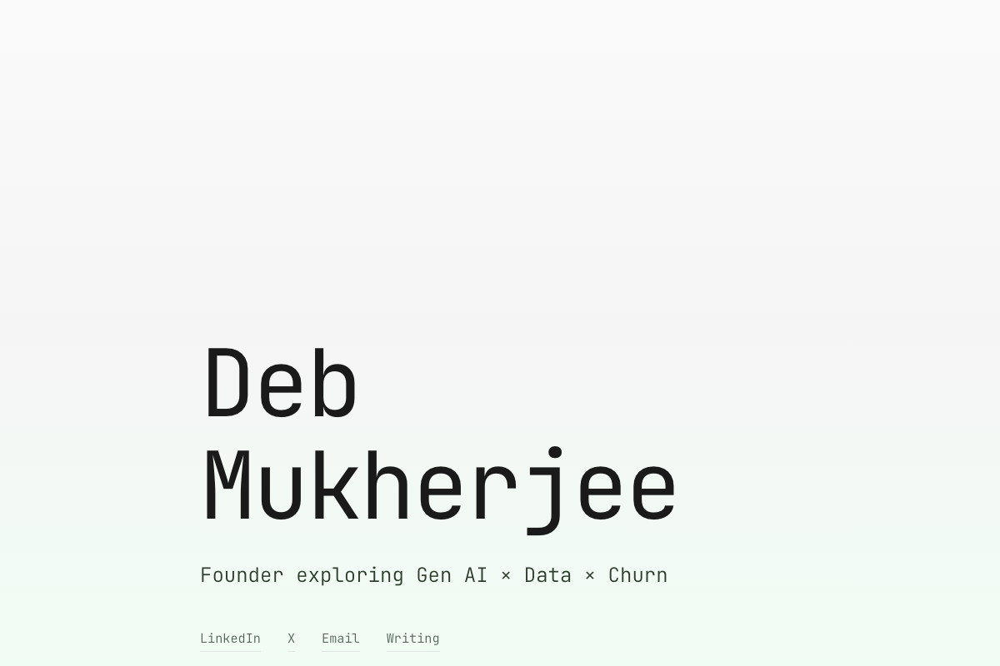

# Founder Template

Professional, clean layout with soft green gradient aesthetic.

## Preview

## Style
- **Colors:** Soft green (#22c55e), light gradient backgrounds
- **Font:** JetBrains Mono (monospace)
- **Vibe:** Professional, trustworthy, founder-focused

## Sections
- Hero with name and tagline
- Bio/About
- Professional experience
- Writing/Blog
- Contact links

## Best For
- Founders
- Entrepreneurs
- Startup operators
- Product leaders

## Customization

Edit `index.html` to change:
- Your name and tagline
- Bio paragraphs
- Work experience
- Social links
- Writing samples

Or use Claude to customize conversationally!

## Deploy

## Live Example

Based on: [debmukherjee.com](https://debmukherjee.com)
