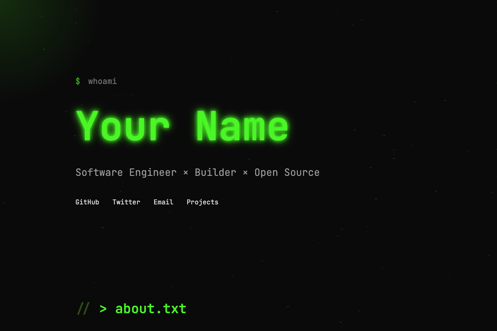

# Developer Dark Mode Template

Terminal/hacker aesthetic with neon green glow on dark background.

## Preview

## Style
- **Colors:** Neon green (#4af626) on deep black (#0a0a0a)
- **Font:** JetBrains Mono (monospace)
- **Vibe:** Terminal, hacker, technical, developer-focused

## Features
- 🌌 Animated particle background
- ✨ Cursor glow effect that follows mouse
- 💻 Terminal-style prompts and commands
- 🎨 Smooth fade-in animations
- 📱 Fully responsive

## Sections
- Hero with terminal prompt
- About section
- Work experience timeline
- Projects showcase with tech stack tags
- Writing/blog posts

## Best For
- Software Engineers
- Technical Founders
- Open Source Developers
- Dev Advocates
- Anyone who loves terminal aesthetics

## Customization

Edit `index.html` to change:
- Your name and tagline
- About text
- Work history
- Projects (with GitHub links)
- Blog posts/writing

Or use Claude to customize conversationally!

## Deploy

## Inspiration

Based on: [fareedmosavat.com](http://fareedmosavat.com/)
