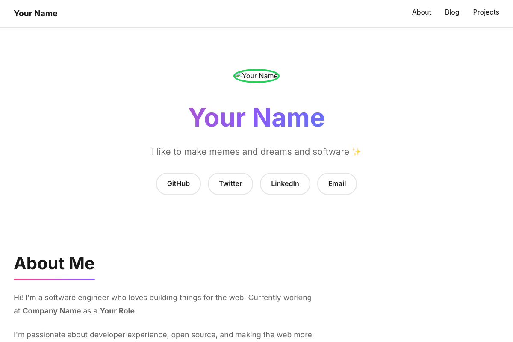

# Playful Developer Template

Colorful, fun, and approachable design for developer advocates and content creators.

## Preview



## Style
- **Colors:** Multi-color palette (green, pink, blue, gold, purple)
- **Font:** Inter
- **Vibe:** Fun, colorful, approachable, energetic

## Features
- 🎨 Vibrant multi-color theme
- ✨ Animated cards on scroll
- 📌 Sticky navigation
- 🌙 Dark mode support
- ♿ Accessibility-focused
- 📱 Fully responsive
- 🎯 Smooth scrolling

## Sections
- Hero with profile picture
- About section
- Blog posts with tags
- Projects showcase
- Social links

## Best For
- Developer advocates
- Tech educators
- Community builders
- Content creators
- Anyone who wants a fun, approachable vibe

## Customization

### Change Colors
Edit the CSS variables in `styles.css`:
```css
:root {
    --green: #24d05a;
    --pink: #eb4888;
    --blue: #10a2f5;
    --gold: #e9bc3f;
    --purple: #8b5cf6;
}
```

### Update Content
Edit `index.html`:
- Change your name and tagline
- Update profile picture src
- Add your blog posts
- Showcase your projects
- Update social links

### Optional Fun Feature
In `script.js`, enable cursor trail:
```javascript
let enableCursorTrail = true;
```

## Inspiration

Based on: [cassidoo.co](https://cassidoo.co) - The perfect balance of professional and playful.

## Deploy

[](https://vercel.com/new/clone?repository-url=https://github.com/YOUR_USERNAME/clean-and-personal/tree/main/templates/05-playful-developer)

## Accessibility

- ✅ WCAG 2.1 AA compliant
- ✅ Keyboard navigation
- ✅ Screen reader friendly
- ✅ Reduced motion support
- ✅ Color contrast checked

## Browser Support

- Chrome (latest)
- Firefox (latest)
- Safari (latest)
- Edge (latest)
