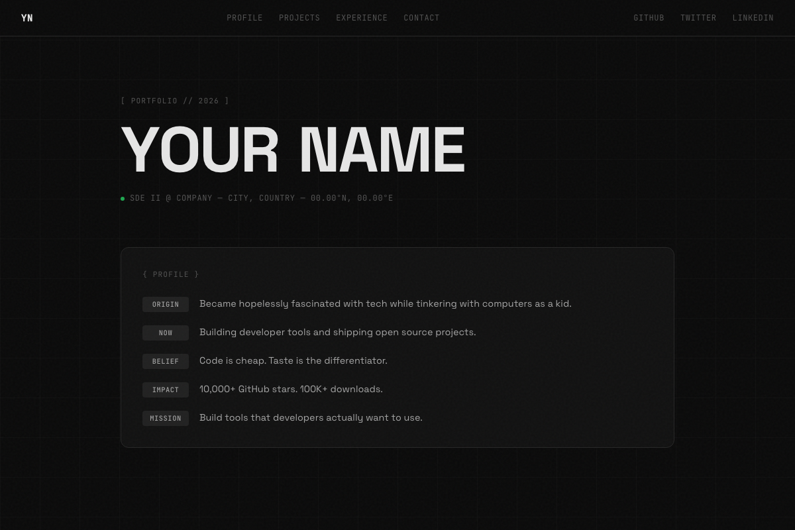

# Dark Engineer Template

Dark grid aesthetic with noise overlay, animated counters, and career timeline. Inspired by modern engineer portfolios.

## Preview

## Style
- **Colors:** Near-black background (#0a0a0a), light text (#e5e5e5), subtle borders
- **Fonts:** Space Grotesk (display), JetBrains Mono (labels/code)
- **Vibe:** Technical, clean, dark mode, developer-focused

## Sections
- Hero with staggered letter animation and status indicator
- Profile with labeled attributes (Origin, Now, Belief, Impact, Mission)
- Metrics with animated counters
- Projects list with stats
- Career timeline with active role indicator
- Tech stack grid with pill tags
- Contact

## Best For
- Software engineers
- Open source creators
- Developer advocates
- Technical founders

## Customization

Edit `index.html` to change:
- Your name and role/location
- Profile entries
- Stats and project list
- Career timeline
- Tech stack pills
- Social links

Or use Claude to customize conversationally!

## Deploy

## Inspired By

[parthjadhav.com](https://www.parthjadhav.com/)
