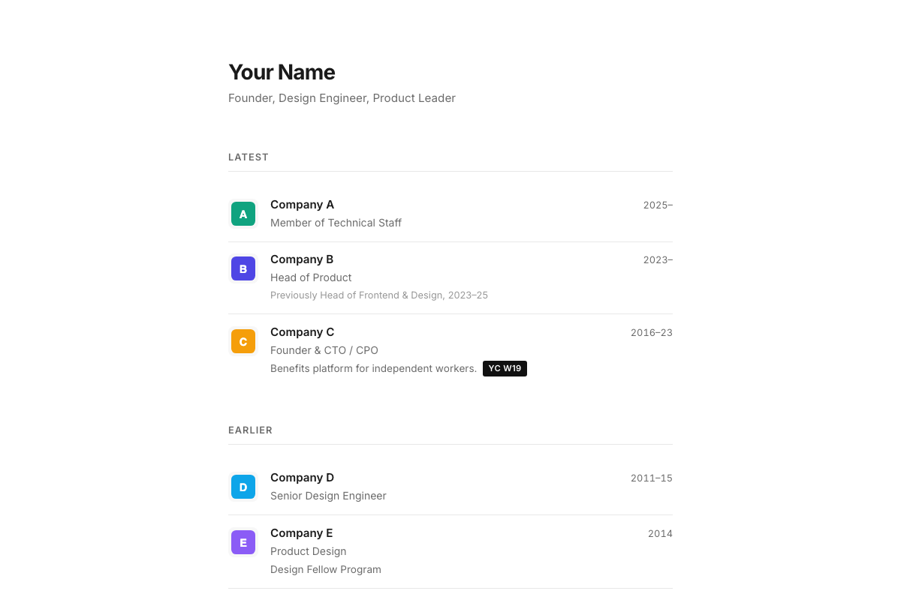
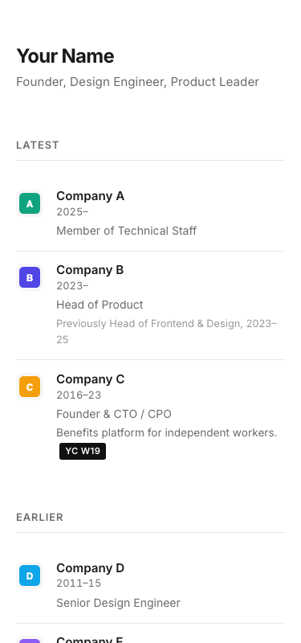

# 63 - Credential Folio

A clean, professional portfolio template with logo-rich work history, credentials section, and press mentions.

## Inspiration

Based on the design of [ambrosino.io](https://ambrosino.io/) - a minimal, text-forward personal site that emphasizes career history and professional credibility through clean information architecture.



## Features

- **Logo Thumbnails**: Company logos alongside each role for visual scanning
- **Grouped Timeline**: Work split into "Latest" and "Earlier" sections
- **Credentials Section**: Licenses, certifications, and registrations
- **Press Mentions**: Dated articles and media coverage
- **Scroll Animations**: Subtle fade-in on scroll
- **Responsive**: Mobile-first, clean on all devices
- **Accessible**: Reduced motion support, focus indicators

## Mobile View



## Customization

### Colors

Edit CSS variables in `styles.css`:

```css
:root {
    --bg: #ffffff;
    --text: #1a1a1a;
    --text-light: #6b6b6b;
    --border: #e8e8e8;
}
```

### Company Logos

Add logo images to `assets/` and update `src` in `index.html`. Recommended size: 40x40px, SVG or PNG with transparent background.

### Sections

Each section (Latest, Earlier, Credentials, Misc) can be removed or reordered in `index.html`.

## File Structure

```
63-credential-folio/
├── index.html       # Main HTML
├── styles.css       # Styles
├── script.js        # Scroll animations
├── config.json      # Template metadata
├── favicon.svg      # Favicon
├── README.md        # This file
└── assets/          # Company logos
    ├── logo-company-a.svg
    ├── logo-company-b.svg
    └── ...
```

## Best For

- Founders and technical leaders
- People with professional licenses or credentials
- Career-focused personal sites
- Anyone who wants to show a clean work history with company logos

## Browser Support

Chrome, Firefox, Safari, Edge (latest 2 versions). Graceful degradation for older browsers.
